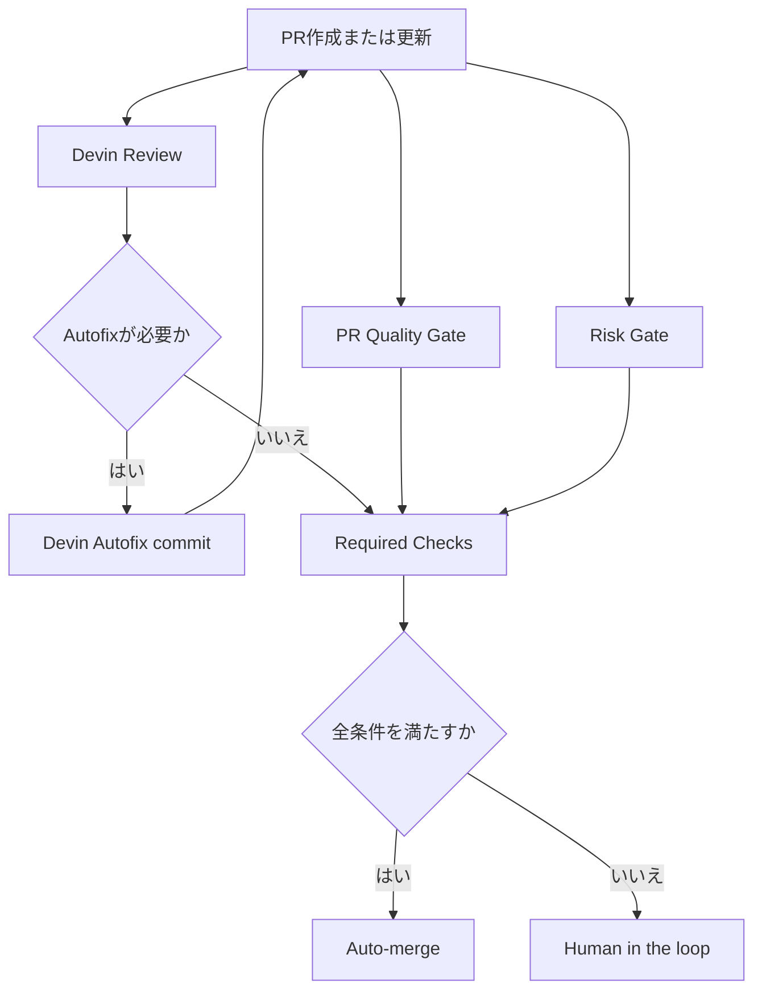

# Devin Review中心の汎用PR自動化運用

## 目的

新規または既存の任意プロジェクトに共通のPR自動化キットを配置し、Pull Request作成後のレビュー、修正、再検証、マージ判定をできる限り自動化します。

基本方針は次の通りです。

```text
Devin Review Native First
+ Risk-Gated Autonomy
+ Human in the loop on exception
```

Devin Reviewに任せられるレビューとAutofixは最大限利用します。ただし、CI失敗、高リスク変更、差分過大、Autofix上限超過、判断不能な状態では自動マージを止め、人間確認へ切り替えます。

このキットは特定の言語やフレームワークへ固定しません。中央リポジトリの reusable workflow を各プロジェクトから呼び出し、各プロジェクトの品質チェックは `.github/devin-automation.yml` の `quality.commands` で指定します。

## 全体フロー



## Devin側設定

Devin GitHub Integrationで、対象リポジトリに対して以下を有効化します。

- PR opened時のAuto-review
- New commits pushed時のRe-review
- Draft PR ready for review時のReview
- Devin Autofix
- Autofix commitの作成権限
- MergeまたはAuto-merge操作

Devin ReviewがGitHub check runを提供している場合は、Branch Protection / Ruleset のRequired Checksへ追加してください。check runがない場合は、PR conversation resolution と `Risk Gate` のDevinコメント検出を補助的に使います。

## GitHub Actions

### PR Quality Gate

中央リポジトリの `.github/workflows/devin-pr-automation.yml` は `scripts/quality-gate.mjs` を実行します。実際の品質チェックは対象プロジェクト側の `.github/devin-automation.yml` の `quality.commands` で定義します。

Node.jsプロジェクトの例です。

```yaml
quality:
  allowEmpty: false
  commands:
    - name: Install dependencies
      run: npm ci
    - name: Lint
      run: npm run lint --if-present
    - name: Typecheck
      run: npm run typecheck --if-present
    - name: Test
      run: npm test --if-present
    - name: Build
      run: npm run build --if-present
```

PythonやGoなどのプロジェクトでは、同じ場所にそのプロジェクトのコマンドを設定します。

```yaml
quality:
  allowEmpty: false
  commands:
    - name: Test
      run: pytest
```

Required Check名は `PR Quality Gate` です。

### Risk Gate

中央リポジトリの `.github/workflows/devin-pr-automation.yml` は `scripts/risk-gate.mjs` も実行します。閾値と高リスクパターンは対象プロジェクト側の `.github/devin-automation.yml` の `risk` で設定します。

初期閾値は次の通りです。

| 項目 | 初期値 |
| --- | ---: |
| `MAX_CHANGED_FILES` | 10 |
| `MAX_DIFF_LINES` | 300 |
| `MAX_AUTOFIX_COUNT` | 1 |
| `REQUIRE_DEVIN_REVIEW_SIGNAL` | false |

設定例です。

```yaml
risk:
  maxChangedFiles: 10
  maxDiffLines: 300
  maxAutofixCount: 1
  requireDevinReviewSignal: false
  commentOnFailure: true
  highRiskPatterns:
    - .github/workflows/**
    - package.json
    - "**/auth/**"
    - "**/.env*"
```

`requireDevinReviewSignal` を `true` にすると、Devin Reviewのコメントまたはレビューが見つからないPRを判断不能として停止します。Devin Reviewの実行タイミングやcheck runの有無が安定してから有効化してください。

## Risk Gate停止条件

次の条件に該当した場合、`Risk Gate` は失敗し、自動マージを止めます。

- `.github/workflows/**` の変更
- `package.json` またはlockfileの変更
- DB migration / schema の変更
- auth / authorization の変更
- payment / billing の変更
- terraform / infra の変更
- `.env*` / secrets 関連の変更
- テストファイルの削除
- 変更ファイル数が `MAX_CHANGED_FILES` を超過
- 差分行数が `MAX_DIFF_LINES` を超過
- Autofix回数が `MAX_AUTOFIX_COUNT` を超過
- Devin Reviewでblocker相当のコメントを検出
- Risk Gate実行中に差分やPR状態を判断できない

高リスクパターンは `.github/devin-automation.yml` の `risk.highRiskPatterns` で管理します。GitHub Actionsの `HIGH_RISK_PATTERNS` 環境変数でも一時上書きできます。

## 新規プロジェクトへの導入

1. 新規プロジェクトをGitHubへpushします。
2. 対象プロジェクトで `npx devin-review-automation init --automation-repository OWNER/devin-review-automation` を実行します。
3. 生成された `.github/devin-automation.yml` の `quality.commands` をプロジェクトに合わせて編集します。
4. Devin GitHub Integrationで対象リポジトリを有効化します。
5. `develop` / `main` にBranch ProtectionまたはRulesetを設定します。
6. Required Checksへ `PR Quality Gate` と `Risk Gate` を追加します。
7. Auto-mergeを有効化します。
8. PRを作成し、Devin Review、Quality Gate、Risk Gateの動作を確認します。

initで対象プロジェクト側に生成されるのは次の2ファイルだけです。

```text
.github/workflows/devin-automation.yml
.github/devin-automation.yml
```

対象プロジェクト側のworkflowは中央リポジトリを呼び出します。

```yaml
jobs:
  devin-pr-automation:
    uses: OWNER/devin-review-automation/.github/workflows/devin-pr-automation.yml@main
    with:
      automation-repository: OWNER/devin-review-automation
      automation-ref: main
    secrets: inherit
```

中央リポジトリがprivateの場合は、対象プロジェクトに `AUTOMATION_TOKEN` secretを追加してください。このtokenには中央リポジトリのcontents read権限が必要です。publicリポジトリとして運用する場合は通常不要です。

## Branch Protection / Ruleset

`develop` と `main` に以下を設定します。

- Require pull request before merging: ON
- Require status checks to pass: ON
- Required Checks: `PR Quality Gate`, `Risk Gate`
- Require conversation resolution before merging: ON推奨
- Direct push: 禁止
- Auto-merge: ON

Devin Reviewのcheck runがある場合は、それもRequired Checksへ追加します。

## 自動マージ判定

```text
IF
  PR Quality Gate == success
  AND Risk Gate == success
  AND Devin Review blocker == false
  AND Required Checks == success
  AND Unknown State == false
THEN
  Auto-merge
ELSE
  Human in the loop
```

`main` でも常時人間承認は必須にしません。ただし、Risk Gateで止まったPRは必ず人間確認へ切り替えます。

## Autofix運用

初期値では `MAX_AUTOFIX_COUNT=1` とします。

```text
Devin Autofix
↓
修正commit
↓
CI再実行
↓
Devin Review再実行
↓
Risk Gate再判定
↓
問題なしなら自動マージ
```

2回以上のAutofixを許容したい場合でも、軽微な修正に限定し、ログを確認してから閾値を上げてください。

## 通知

Risk Gateが失敗した場合、GitHub Step SummaryとPRコメントに停止理由を出します。

Slack / Discord通知を追加する場合は、`risk-gate.yml` の失敗時ステップとしてWebhook通知を追加してください。Secret名は例として以下を推奨します。

- `SLACK_WEBHOOK_URL`
- `DISCORD_WEBHOOK_URL`

## 推奨フェーズ

### Phase 1: developのみ自動化

- `develop` へのAuto-mergeを有効化
- `main` は手動マージ
- Risk Gateの誤検知と漏れを確認

### Phase 2: mainの低リスクPRだけ自動化

- `Risk Gate` passのPRのみ `main` Auto-merge
- 高リスクPRは人間確認
- 2週間程度ログを確認

### Phase 3: main自動化範囲を調整

- 差分閾値を調整
- Autofix許容回数を調整
- 高リスクファイル定義を見直す

## 復旧手順

自動マージで問題が起きた場合は、以下の順に対応します。

1. GitHub Auto-mergeを一時停止します。
2. 問題PRをrevertします。
3. `Risk Gate` の停止条件に漏れがないか確認します。
4. 必要に応じて `HIGH_RISK_PATTERNS` または閾値を厳しくします。
5. Devin Review / Autofix のログを確認します。
6. 再発防止後にAuto-mergeを再開します。
